# Inventarsystem

[](https://wakatime.com/badge/user/30b8509f-5e17-4d16-b6b8-3ca0f3f936d3/project/8a380b7f-389f-4a7e-8877-0fe9e1a4c243)

Ein webbasiertes Inventarverwaltungssystem, das es Benutzern ermöglicht, Gegenstände zu verfolgen, auszuleihen und zurückzugeben. Das System verfügt über administrative Funktionen, Bildverwaltung und eine filterbasierte Artikelsuche.

## Funktionen

- Benutzeranmeldung mit sicheren Passwort-Richtlinien (Das Password braucht midestens 12 Zeichen!)
- Rollenbasierter Zugriff (Admin und reguläre Benutzer)
- Artikelverwaltung (hinzufügen, löschen, ausleihen, zurückgeben)
- Mehrfachbild-Upload und Verwaltung für jeden Artikel
- Artikel-Filterung basierend auf benutzerdefinierten Kategorien
- QR-Code-Generierung zur einfachen Identifikation von Artikeln
- Responsives Design für Desktop- und Mobilgeräte

## Installation

### Voraussetzungen

- Python 3.7+
- MongoDB
- pip

### Einrichtung

Installation des Systems mit dem Installations-Script(for Linux):

```bash
wget -O - https://raw.githubusercontent.com/aiirondev/Inventarsystem/main/start-codespace.sh | sudo bash
```

OR

```bash
curl -s https://raw.githubusercontent.com/aiirondev/Inventarsystem/main/start-codespace.sh | sudo bash
```

## Benutzerhandbuch

### Für reguläre Benutzer

#### Login und Hauptseite

1. Den Nutzernamen und das Password in die Dafür vorhergesehenen Felder eintragen.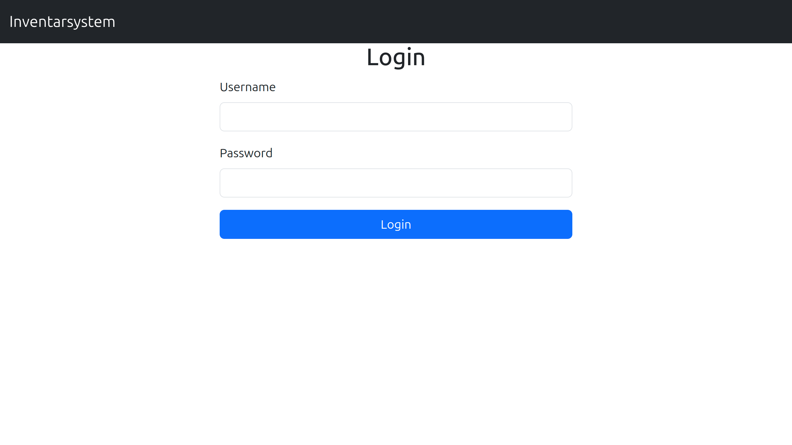

2. Auf den Blauen Knopf mit der Aufschrift "Login" tippen.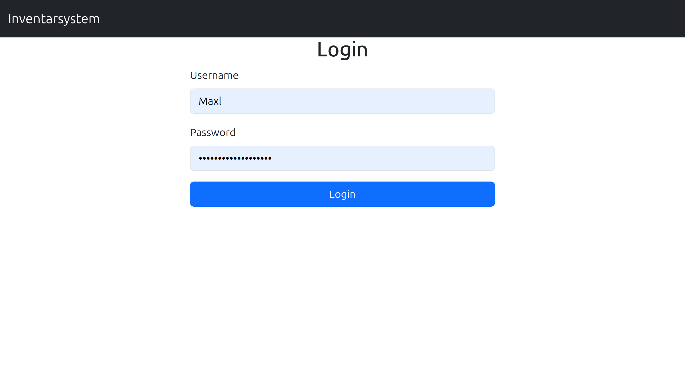

#### Artikel durchsuchen

- Die Hauptseite zeigt alle verfügbaren Artikel in einer kartenbasierten Ansicht.
- Navigationspfeile (links/rechts) zum Durchblättern der Artikel nutzen.
- Jeder Artikel zeigt:
  - Name
  - Ort
  - Beschreibung
  - Bilder (mit Pfeilen durch mehrere Bilder blättern)
  - Filterkategorien

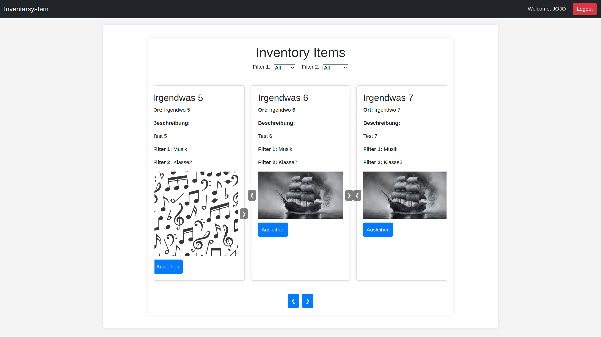

#### Artikel filtern

- Die Dropdown-Menüs "Filter 1" und "Filter 2" zur Eingrenzung der Suche nutzen.

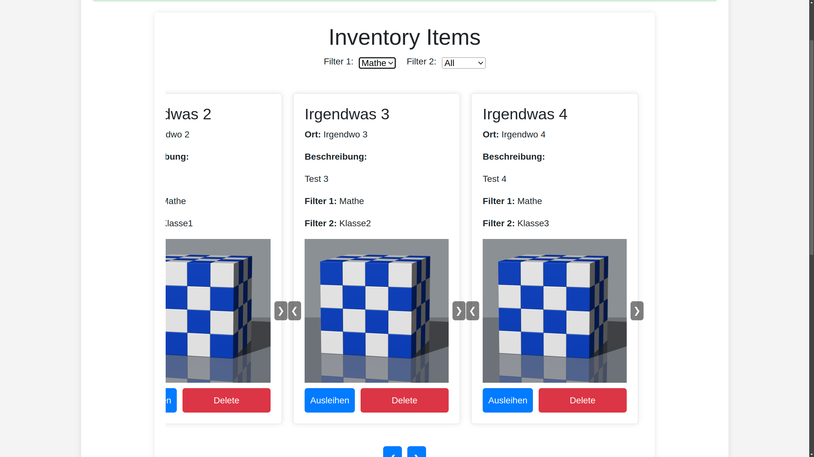 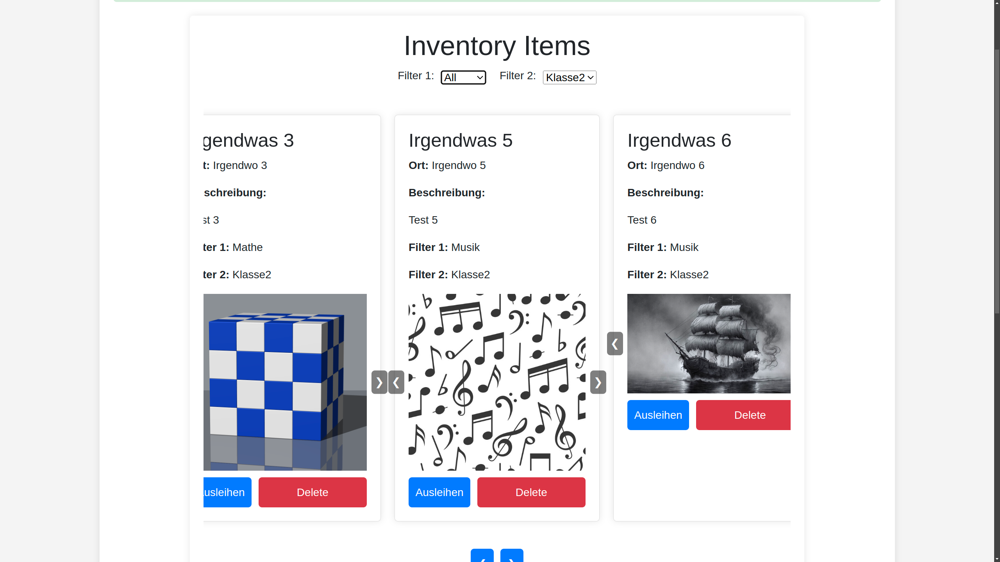

- Optionen aus beiden Dropdown-Menüs auswählen, um kombinierte Filter anzuwenden.

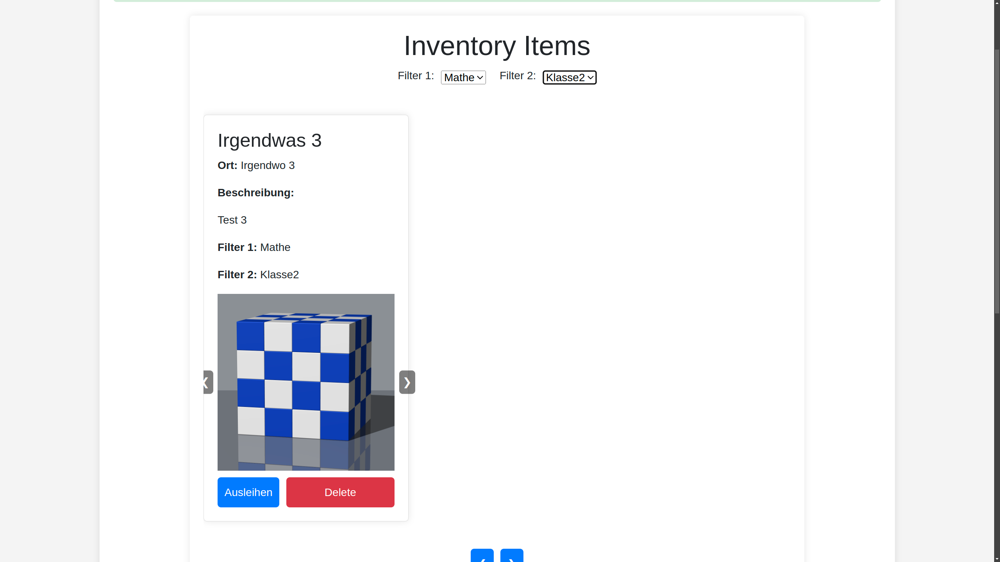 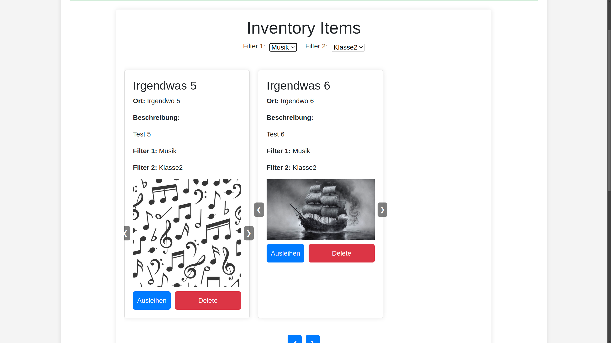

- Um alle Artikel wieder anzuzeigen, "Alle" in beiden Filtern auswählen.

#### Artikel ausleihen und zurückgeben

- Um einen verfügbaren Artikel auszuleihen, auf den "Ausleihen"-Button klicken.
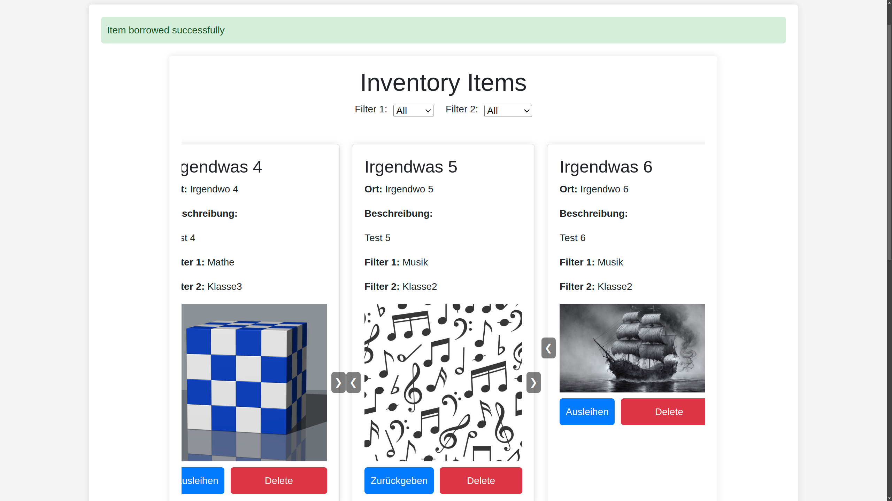
- Um einen ausgeliehenen Artikel zurückzugeben, den Artikel suchen und auf "Zurückgeben" klicken.
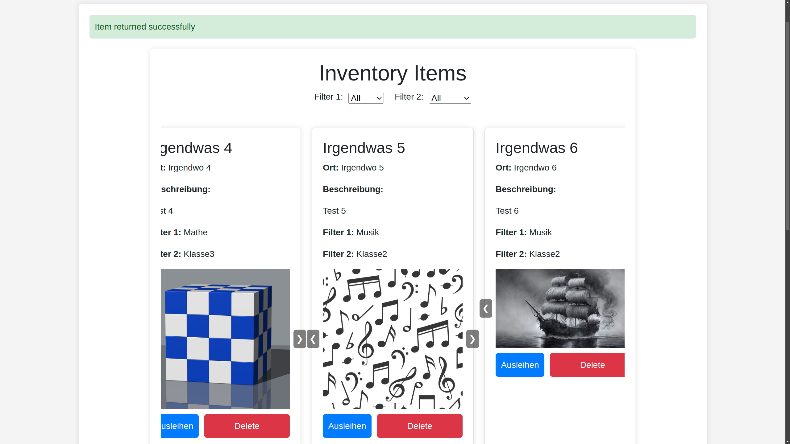
- Das System verfolgt die Zeitpunkte von Ausleihe und Rückgabe.

### Für Administratoren

#### Admin-Oberfläche

- Mit Administrator-Zugangsdaten anmelden, um auf die Admin-Oberfläche zuzugreifen.
- Die Admin-Oberfläche bietet alle Standardfunktionen sowie zusätzliche Verwaltungsfunktionen.

#### Neue Artikel hinzufügen

1. In der Admin-Oberfläche zum Formular "Artikel hochladen" scrollen.
2. Folgende Informationen eingeben:
   - **Name**: Eindeutige Bezeichnung des Artikels
   - **Ort**: Lagerort des Artikels
   - **Beschreibung**: Detaillierte Informationen
   - **Filter 1 & Filter 2**: Kategorien zur Organisation
   - **Bilder hochladen**: Ein oder mehrere Bilder des Artikels auswählen
3. Auf "Hochladen" klicken, um den Artikel zum Inventar hinzuzufügen.

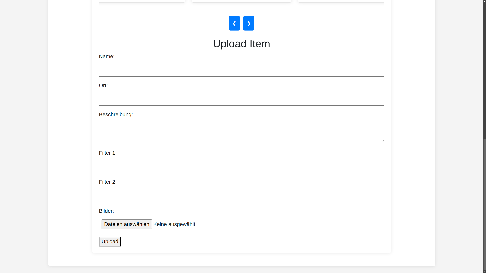

#### Artikel löschen

- Den gewünschten Artikel finden und auf "Delete" klicken.
- Der Artikel und zugehörige Bilder werden aus dem System entfernt.
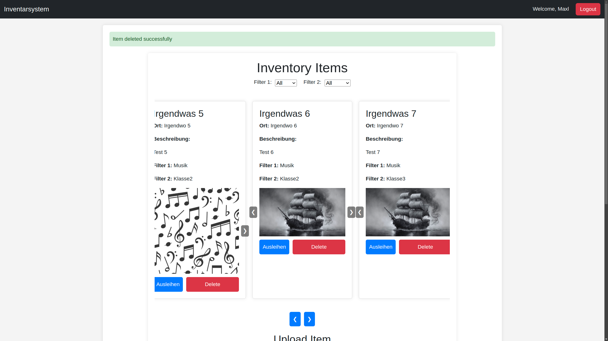

#### Ausgeliehene Artikel verwalten

- Administratoren können alle Artikel einsehen, einschließlich ausgeliehener Artikel.
- Falls erforderlich, können Administratoren Artikel im Namen der Benutzer zurückgeben.

### QR-Code-System

Jeder Artikel wird bei der Erstellung automatisch mit einem eindeutigen QR-Code versehen. Diese QR-Codes können ausgedruckt und an physischen Gegenständen angebracht werden, um eine einfache Identifikation durch Scannen zu ermöglichen.

## Lizenz

Dieses Projekt ist unter der Apache License, Version 2.0 lizenziert. Siehe die LICENSE-Datei für Details.

## Mitwirkende

**Maximilian Gründinger** - Projektgründer

Für technische Unterstützung oder Fragen bitte ein Issue im GitHub-Repository eröffnen.
